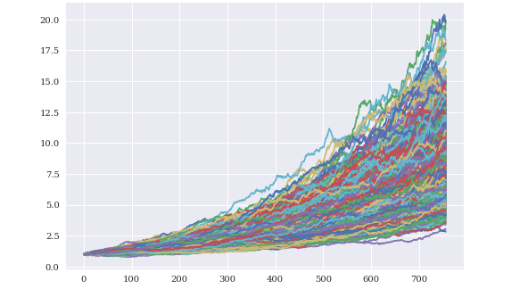

# Security Analysis: The Elites of 2017

## Background 

My boss came into my office one day and gave me a file with a list of NASDAQ companies. She says, "Dana, I want you to find me the companies that went public on NASDAQ in 2017 and make a portfolio with the stocks of best-performing companies. We have to show the clients why those companies are good to invest, too. Get it done by the meeting on Friday morning."     

## Files

* [nasdaq_companies.csv](data/nasdaq_companies.csv)

## Plan

To provide a profitable portfolio I need to accomplish six main tasks:

1. [Data Modeling](#Data-Modeling): Clean the Data. Find which companies went public in 2017.

2. [Visualization](#Visualization): Calculate the cumulative returns and visualize the data.

3. [Performance Analysis](#Performance-Analysis): Pick the stocks with the most successful track record in the past 3 years.

4. [Portfolio Creation and Analysis](#Portfolio-Creation-and-Analysis): Create a portfolio with the best-performing companies.

5. [Forecasting](#Forecasting): Find the estimated range of return of investment the portfolio can deliver in 3 years.

6. [Dashboard](#Dashboard): Create a dashboard with different tabs.

## Analytical & Visualization Tools

* Microsoft Excel: Used to create a pivot table to identity the stocks that IPO'ed in specific years.
* Python Pandas: Used to create data frames and to model datasets in preparation for the quantitative analysis.
* Alpaca APIs: Used to pull stock data.
* Python Holoviews: Used for visualization.
* Python Panel: Used to create an interactive dashboard panel.   

### Data Modeling

* __Method__: From the [nasdaq_companies.csv](data/nasdaq_companies.csv), a Pivot table is created using Microsoft excel to identify the companies that went public in 2017.

* __Observation__: 119 companies went public in 2017.

### Visualization 

* __Method__: Using the Alpaca APIs, the three-year historical data is pulled to create the dataset that combines all the prices by grouped by their companies. Then, using the Pandas and Holoviews library, an interactive cumulative returns chart is created to identify the companies that gained higher returns consistently.

* __Observation__: Many companies were unlisted from the NASDAQ after 2018. After looking further, some companies were acquired early after they went public.

### Performance Analysis

* __Method__: The interactive chart gives an easy way to visualize and identify the top companies within the selected year. Afterward, a CSV file with the information on the selected top 10 companies is created and saved in the [data](data) folder. 

* __File__: [top_10.csv](data/top_10.csv)

* __Observation__: In the top 10 companies that IPO'ed in 2017, the Health Care and Technology sectors have the highest amount of companies with 4 companies which performed very well. Finance and Consumer Services sector represented 1 company each that performed well.

### Portfolio Creation and Analysis

* __Method__: Using the Alpaca APIs, the stock market data of the 10 companies are pulled to create a dataset. The dataset is used to create the cumulative returns curve of the evenly weighted portfolio consisted of the top 10 highest performing companies. 

* __Observation__: The standard deviation of the portfolio is 2.17% for the past three years. The Sharpe ratio is 2.16 which means the average annual rate of return was higher than the annualized volatility. The curve also resembles the price chart of [NASDAQ 100 Composite (index: NDX)](https://www.nasdaq.com/market-activity/index/ndx). Select the 5 years tab to view the resemblance. The observation is not surprising as the NDX is composed of the top 100 largest companies in NASDAQ.    

### Forecasting

* __Method__: Using the Monte Carlo simulation, the cumulative returns of the portfolio is computed 1000 times for the next 3 years.

* __Observation__: There is a 95% chance that the initial investment of 1,000 USD in the portfolio over the next 3 years will end within the range of 4,180 USD and 14,828 USD.

### Dashboard

* __Method__: Using the panel library, the Holoviews charts are compiled into tabs to showcase the dashboard that has the portfolio data charts, and the individual stock data charts.

* __Note__: This is a sample. Use the python notebook [number 6](6.dashboard.ipynb) to recreate and view the dashboard.  
